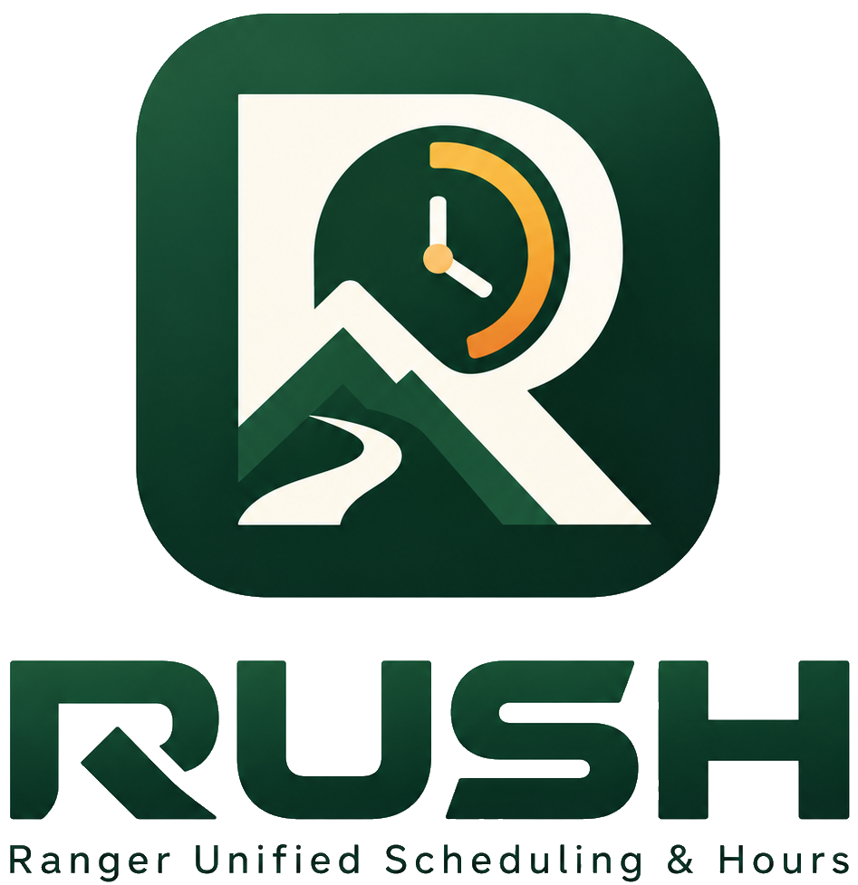

<div align="center">
  

  **Fair schedules. Clear coverage. Trusted hours.**

  An installable, offline-capable scheduling and hours application built for Ranger teams.
</div>

## About RUSH

**RUSH** stands for **Ranger Unified Scheduling & Hours**. It helps seasonal Ranger teams coordinate staffing, balance demanding shifts fairly, respond to schedule changes, and maintain trustworthy records of hours worked.

RUSH is designed around the realities of small teams: staffing needs change throughout a season, availability changes at short notice, some shifts are less desirable than others, and management sometimes needs to cover gaps. RUSH makes those constraints visible while keeping everyday work simple for Rangers.

The initial version is designed for a team of roughly **5–15 Rangers**, with the architecture kept maintainable for future growth.

## Features

### Scheduling and coverage

- **Season-based planning:** Define operational phases with different shift patterns, staffing requirements, and coverage policies.
- **Flexible coverage models:** Schedule dedicated areas or shared coverage groups, depending on the phase.
- **Assisted schedule generation:** Prepare editable schedules based on staffing needs, availability, preferences, hour limits, and fairness history.
- **Fairness over time:** Prioritize balance within each week, taking season-long patterns and recurring undesirable shifts into account.
- **Visible staffing gaps:** Identify unfilled positions, flag conflicts, and suggest possible replacements without hiding shortages.
- **Draft review and publication:** Release drafts for visibility, publish in weekly or multiweek blocks, and preserve published assignments.
- **Events and meetings:** Schedule individual events, including paid meetings, alongside ordinary shift coverage.

### Tools for Rangers

- View personal assignments and the published team schedule.
- Record unavailability and preferred shifts or working patterns.
- Request shift swaps or transfers, subject to the agreement of everyone involved and management approval.
- Mark **Ready for Shift** and **Finished** as lightweight activity records.
- Review, correct, and submit a weekly timesheet.
- Receive in-app notifications about schedule changes and review actions.
- Manually share prepared shift messages through the device's share interface, including to Signal where supported.

### Hours and accountability

RUSH distinguishes **scheduled hours**, **shift activity timestamps**, **reported worked hours**, and **finalized hours**. Ready and Finished actions do not automatically change payable hours.

Timesheets start with scheduled assignments and paid events. Rangers can report exceptions, and management can review corrections or finalize missing submissions with an audit trail. Management can also record coverage of unfilled positions separately from Rangers' paid hours.

Management can review staffing and hours summaries, export CSV or JSON, and manually deliver configured exports to an HTTPS endpoint.

## Offline-first by design

RUSH is a **Progressive Web App (PWA)** that can be added to a phone's home screen without going through an app store.

The Client uses **Dexie.js and IndexedDB** to store authorized schedule data and pending changes on the device. Rangers can view previously synchronized information and perform supported actions during an interruption, then synchronize when connectivity returns.

Laravel remains authoritative for official schedules, approvals, timesheet finalization, and exports. Pending actions and synchronization conflicts must be shown clearly rather than silently treated as accepted. Offline operation depends on data previously synchronized to the device; the application does not guarantee that browser storage cannot be cleared or evicted.

## Technology

| Layer | Stack |
| --- | --- |
| **Client** | Vue 3, TypeScript, Composition API, Quasar |
| **Calendar and forms** | Quasar QCalendar, QDate, QTime |
| **Offline data** | Dexie.js, IndexedDB |
| **PWA** | Quasar PWA mode, Workbox |
| **Client state** | Pinia |
| **Server** | Laravel, Orchid |
| **Authentication** | Laravel Sanctum |
| **Database** | PostgreSQL |
| **Web entry point** | Caddy |
| **Development / deployment** | Docker Compose |
| **Testing** | Pest, Vitest, Playwright |

The codebase has two applications:

- **`server/`** — Laravel API, business rules, persistence, background jobs, and Orchid administration.
- **`client/`** — Vue/Quasar interface for Rangers and suitable interactive management workflows.

In production, both are served from one origin: the Client at `/`, Orchid at `/admin`, and the Laravel API under `/api/v1/`. The deployment is intended to work on a modest VPS or privately hosted hardware, without a required managed database or paid synchronization service.

## Project status

**Status: RUSH-002 compose and routing implemented.**

RUSH V1 is defined by **38 functional requirements** and **nine acceptance scenarios**. The [V1 implementation plan](docs/RUSH_V1_Implementation_Plan.md) organizes the work into **seven milestones and 49 development tasks**, with testable acceptance criteria, requirement traceability, and a target release of `v1.0.0`.

The repository now contains the initial `server/` Laravel/Orchid application, the
`client/` Quasar/Vue/TypeScript application shell, and the production-style Docker Compose
entry point for Caddy, PHP-FPM, and private PostgreSQL routing. Authentication, domain
models, synchronization, and deployment hardening are assigned to later tasks in the
implementation plan.

### Bootstrap commands

The development workflow assumes a Unix workspace and a POSIX-compatible shell.
Run these commands from the repository root in a clean checkout:

```sh
composer install --working-dir=server
cp server/.env.example server/.env
touch server/database/database.sqlite
php server/artisan key:generate
php server/artisan migrate --force
npm install --prefix client
npm install --prefix client/src-pwa
```

Useful checks:

```sh
npm run server:test
npm run server:format
npm run client:lint
npm run client:test
npm run client:build
npm run client:build:pwa
```

### Compose routing

RUSH-002 adds a production-style Compose environment. Create a root `.env` from
`.env.example`, set `APP_KEY` and a non-default `POSTGRES_PASSWORD`, then build and start
the single-origin stack:

```sh
docker compose up -d --build
docker compose exec server php artisan migrate --force
```

By default Caddy publishes ports `80` and `443`, serves the built Client at `/`, forwards
Laravel and Orchid paths such as `/admin`, `/api/v1/*`, `/vendor/orchid/*`, and `/up` to the
Server, and keeps PostgreSQL on an internal Docker network with no public database port.
For local smoke tests without privileged ports, set `RUSH_HTTP_PORT=8080` and
`RUSH_HTTPS_PORT=8443` in the root `.env`.

The Server image uses PHP 8.4 and verifies the locked production dependencies against
the final runtime during its build. After a Server Dockerfile update, rebuild and recreate
the running container (restarting an existing container does not update its image):

```sh
docker compose up -d --build --no-deps server
```

### Implementation roadmap

Each milestone contains seven bounded tasks and ends with a working, verifiable result. Refer to the [implementation plan](docs/RUSH_V1_Implementation_Plan.md) for task IDs, dependencies, completion criteria, and mandatory acceptance tests.

1. **Foundation:** Repository, Docker, authentication, Server, Client, and PWA setup.
2. **Offline infrastructure:** Dexie persistence, synchronization, conflict handling, and offline tests.
3. **Scheduling configuration:** Seasons, phases, shifts, coverage, availability, preferences, and events.
4. **Planning and publication:** Schedule generation, fairness, drafts, gaps, and publication.
5. **Schedule operations:** Calendars, changes, swaps, transfers, approvals, and notifications.
6. **Hours and timesheets:** Activity records, weekly confirmation, corrections, and management coverage.
7. **Reporting and release:** Exports, auditability, deployment hardening, and acceptance testing.

### Development workflow

Development uses task-scoped branches, Conventional Commits, and reviewed pull requests:

- **Branches:** One branch per task, such as `feat/RUSH-023-draft-publication`.
- **Commits:** Group related changes by behavior, including applicable tests. Use `<type>(<scope>): <imperative summary>` and include `Refs: RUSH-###`, relevant `Requirements: R-##`, and actual `Tests:` results in the commit body.
- **Pull requests:** Normally one PR per task. Include requirement references, implementation decisions, verified tests, and screenshots where relevant. Squash merge after checks and review.
- **Definition of done:** The completed behavior works through the appropriate UI/API, passes relevant tests, enforces permissions, preserves auditability, and satisfies the specified offline behavior.
- **Releases:** Milestone checkpoints lead to `v1.0.0`. V1 is complete only when all 38 requirements and all nine acceptance scenarios are verified.

The [implementation plan](docs/RUSH_V1_Implementation_Plan.md) defines the full Git conventions, task breakdown, and acceptance requirements. The functional requirements and technical specification take precedence if a plan summary is ambiguous.

## Development documentation

These documents guide implementation:

- [`docs/RUSH_V1_Requirements.md`](docs/RUSH_V1_Requirements.md) — Functional behavior, exclusions, and acceptance scenarios.
- [`docs/RUSH_V1_Technical_Specification.md`](docs/RUSH_V1_Technical_Specification.md) — Architecture, offline contract, conventions, and implementation milestones.
- [`docs/RUSH_V1_Implementation_Plan.md`](docs/RUSH_V1_Implementation_Plan.md) — Seven milestones, 49 development tasks, Git workflow, requirements traceability, and V1 release criteria.
- [`AGENTS.md`](AGENTS.md) — Instructions and guardrails for AI-assisted development.

The requirements and technical specification are the source of truth for implementing features. Exact database models and API contracts will be derived incrementally as cohesive, tested domain slices.

## Guiding principles

- **Ranger-friendly:** Clear interactions that work for people with varying technical experience.
- **Fairness with transparency:** Show the reasons behind scheduling decisions and make exceptions visible.
- **Offline reliability:** Preserve pending work and provide understandable synchronization status.
- **Human authority:** Management controls publication, exceptions, and official changes.
- **Trustworthy hours:** Keep scheduled, observed, reported, and finalized time distinct.
- **Practical ownership:** Favor maintainable, self-hostable, free/open-source tooling with minimal operational cost.

---

<div align="center">
  <strong>RUSH</strong> · Ranger Unified Scheduling & Hours
</div>
