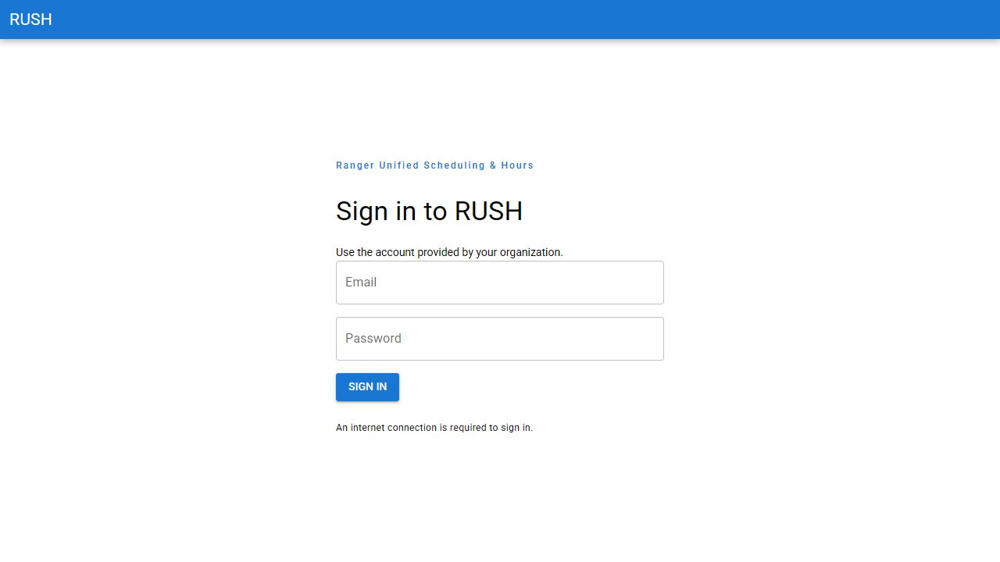
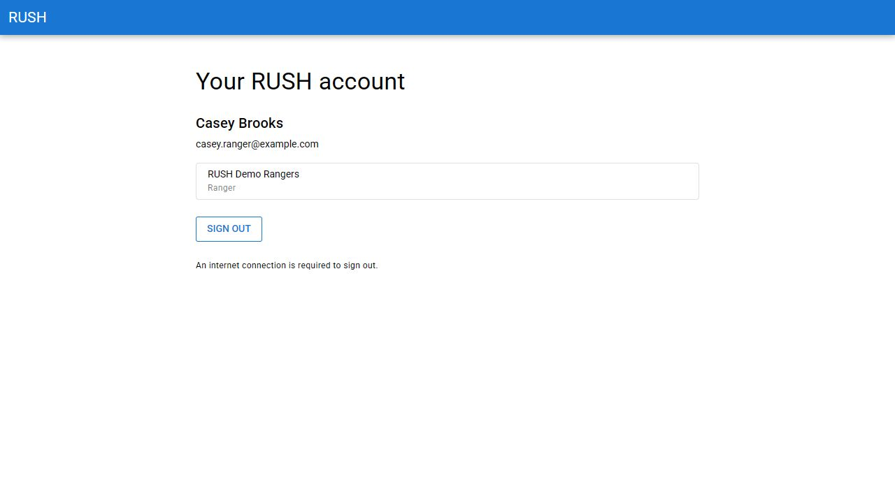
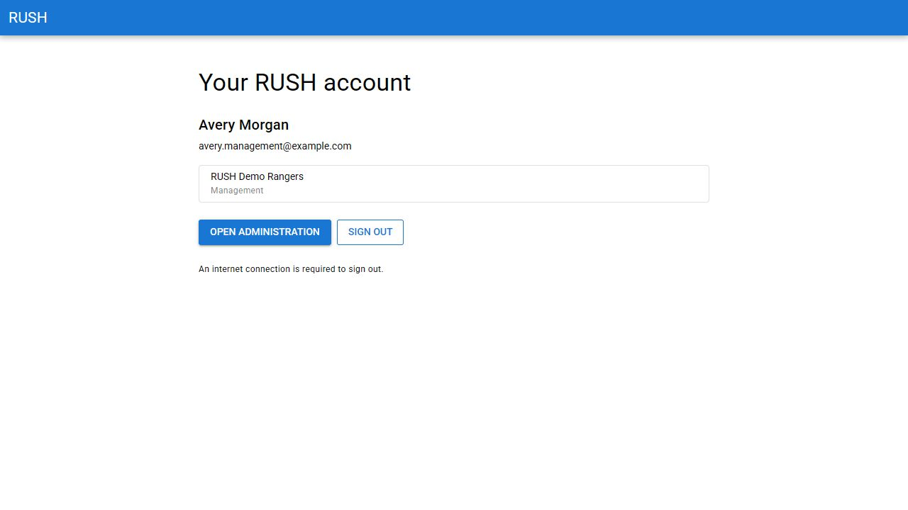
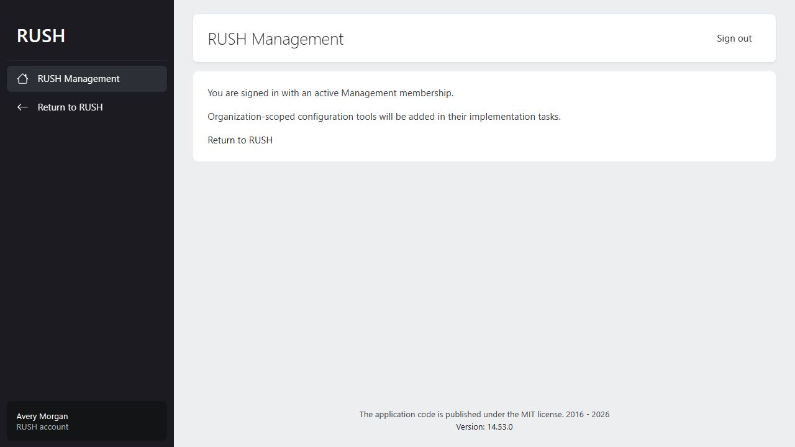

# RUSH-004 verification

Executed 2026-10-09 on the task branch. Uses a separate local SQLite smoke database
with the repository's demo fixture; images contain synthetic fixture accounts only.

## Automated coverage

- `composer test` in `server/`: 31 Pest tests passed, 278 assertions, including
  session and identity policies plus all prior foundation tests.
- `composer format:check` in `server/`: Pint passed.
- `composer validate --no-check-publish` in `server/`: passed.
- `npm run test:unit` in `client/`: 10 Vitest tests passed.
- `npm run lint:check` in `client/`: Prettier and ESLint passed.
- `npm run typecheck` in `client/`: Vue/TypeScript passed.
- `npm run build` and `npm run build:pwa` in `client/`: passed.
- Fresh migration and demo seed completed against the separate SQLite smoke DB.

Server tests exercise real CSRF middleware outside Laravel's testing bypass, and
database-backed cookie replay before/after logout and idle expiry. Client tests
check failed sign-out, account changes, CSRF headers, and reauthentication.

## Browser verification

Using the Quasar dev proxy at `http://localhost:9000` and Laravel at port 8000:

1. Guest account page redirects to sign-in.
2. Ranger signs in and sees only their account/organization/role.
3. Reload retains the cookie session and rechecks identity with the Server.
4. Ranger signs out and returns to an empty sign-in form.
5. Management signs in after Ranger logout; no Ranger identity remains.
6. Management opens Orchid without another login.
7. Orchid's standard sign-out action returns to the Client sign-in page.

## Limits

Browser steps above are interactive smoke checks, not a committed Playwright suite.
RUSH-007 owns automated browser/CI infrastructure. The PWA build is checked here;
offline operational persistence/reconciliation tests remain RUSH-008–014. PostgreSQL
deployment and production HTTPS browser checks are not claimed by this evidence.
