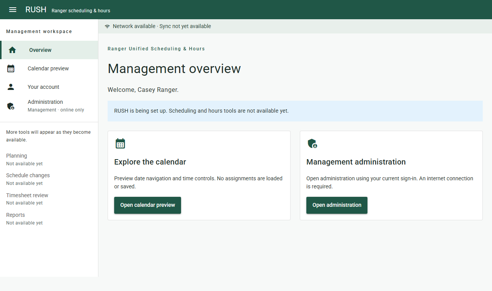
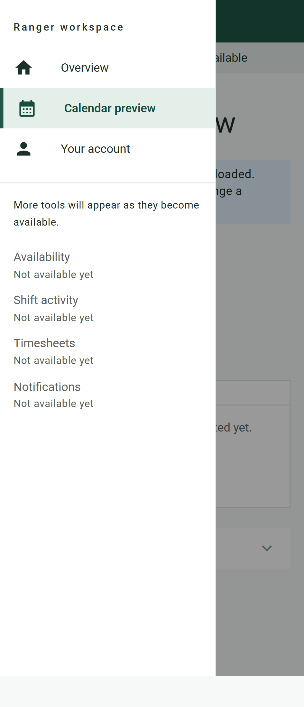
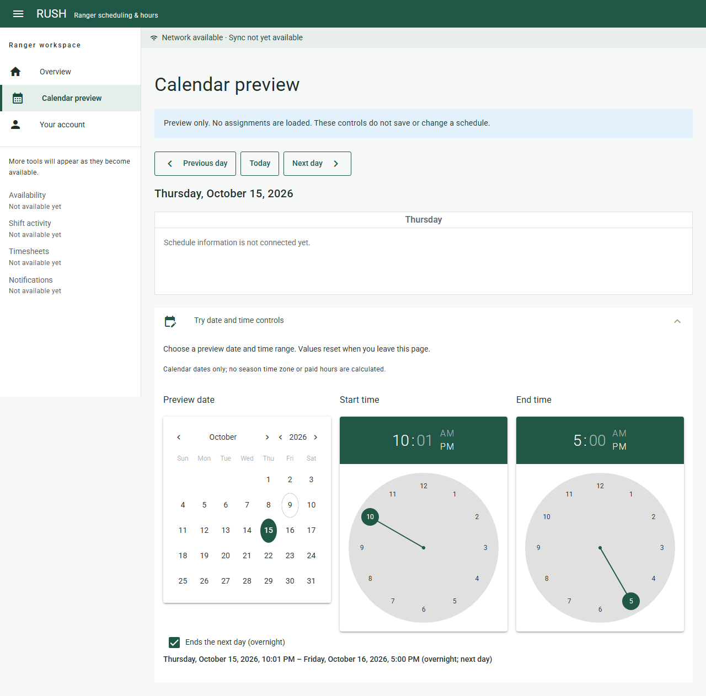
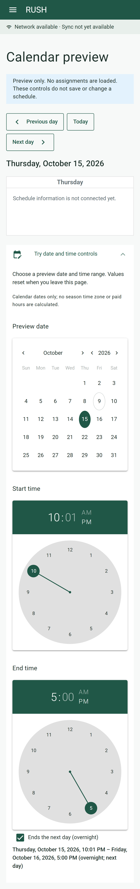

# RUSH-005 verification

Executed 2026-10-09. RUSH-001–004 are merged prerequisites on production.
This task covers Technical §§3 and 9; cross-cutting UI support for R-01–R-38.
The nine operational acceptance scenarios retain their existing later-task owners.

## Results

| Command | Result |
| --- | --- |
| npm --prefix client run test:unit | 16 passed |
| npm --prefix client run test:shell -- --workers=2 | 12 passed: six scenarios on desktop and mobile Chromium |
| npm --prefix client run lint:check | Prettier and ESLint passed |
| npm --prefix client run typecheck | Passed |
| npx tsc --ignoreConfig --noEmit --target es2022 --module nodenext --moduleResolution nodenext --types node --skipLibCheck e2e/shell.spec.ts playwright.config.ts (in client) | Browser tests/config type check passed |
| npm --prefix client run build | Production SPA build passed |
| npm --prefix client run build:pwa | Production PWA build passed |
| composer --working-dir=server test | 31 passed, 278 assertions |
| npm --prefix client audit --omit=dev --json | No runtime dependency vulnerabilities reported |
| git diff --check | Passed |

Initial browser runs identified duplicate main landmarks and missing current-page
ARIA metadata; both were fixed and the full browser suite passed afterward.
The existing development dependency audit still reports four high findings in the
ESLint-config/fast-glob/micromatch/braces chain. Those packages were not changed;
the runtime audit is clean.

## Acceptance coverage

- Ranger overview/navigation and Management overview/navigation show only the
  applicable administration entry. Unavailable future tools are explicitly labeled.
- Management entry is a same-origin /admin link. Existing Pest tests verify actual
  Management access, Ranger/guest denial, membership revocation, and disabled global
  Orchid starter tools. The existing Orchid home returns to the Client and signs out.
- Keyboard skip link, focused route headings, page titles, current-page indicator,
  and mobile drawer closure work. Desktop cards and calendar controls stack on mobile;
  browser assertions check no horizontal overflow at 360px and 320px.
- Guests and expired sessions cannot display protected pages. Network failure shows
  a retry action without stale account content. Role revocation removes admin links.
  Confirmed logout returns to sign-in; unconfirmed offline logout preserves identity
  and displays a retryable error.
- Real QCalendar renders the selected day. Previous/next navigation, keyboard QDate
  selection, no-unset behavior, QTime keyboard hour/minute changes, AM/PM selection,
  invalid same-day ranges, and explicit overnight labels pass.
- Preview state resets after reload and no localStorage persistence is introduced.
  Vitest covers weekday labels, midnight/noon, year/leap-day transitions, date-only
  DST-boundary arithmetic, and explicit overnight dates across week/year boundaries.
- Connectivity text reports a browser hint and explicitly says sync is unavailable.
  It never claims Server acceptance, successful sync, or an authoritative empty schedule.

## Screenshots

These are synthetic browser-test identities, captured from the built Client.
Screenshots were visually inspected on desktop and mobile.

## Reproduction and limits

From client, run npm ci, npx playwright install chromium, npm run build,
and npm run test:shell. The suite starts a loopback static server on port 9105
and mocks session responses; no production accounts or credentials are used.

Server authorization is exercised separately by Pest with SQLite. This evidence
does not claim a new full-stack browser login/Orchid test, PostgreSQL deployment,
HTTPS verification, screen-reader certification, or offline PWA reconciliation.
RUSH-007 owns full-stack CI/E2E, and RUSH-011–014 own the production-PWA offline proof.
No Server or database/sync change is required. Human PR review and merge remain
necessary for the project's task definition of done.
